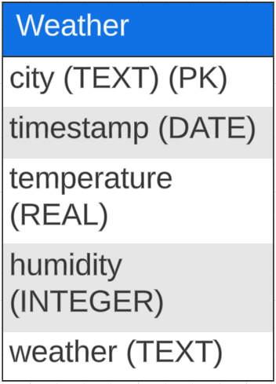
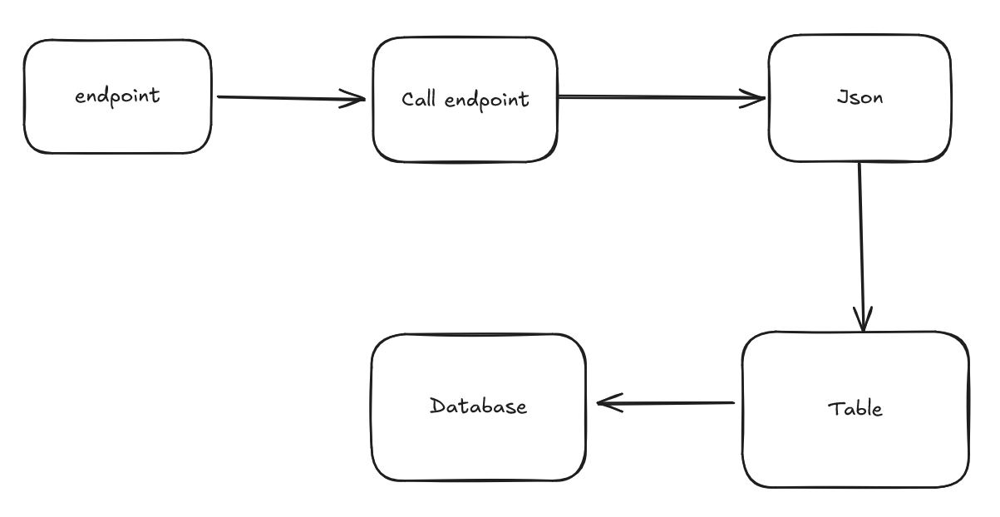
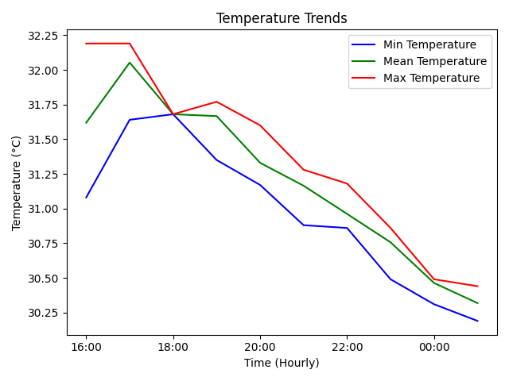
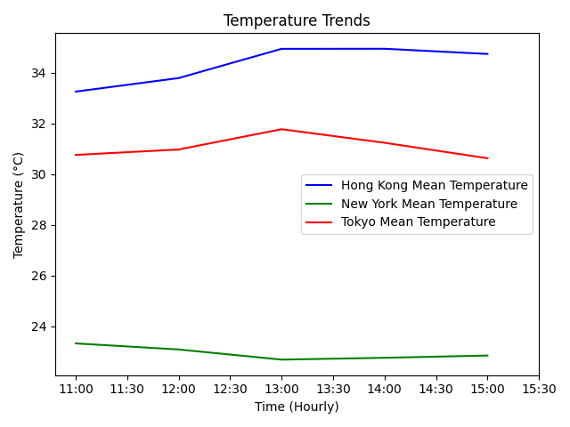
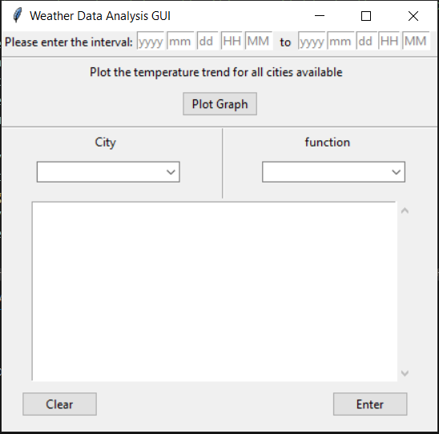

# Introduction
This project encompasses two components: data pipeline and graphical user interface (GUI). For the first component, it is to build a complete pipeline to fetch, process and store weather data. For the second component, it is to build a graphical uesr interface for user to interact with weather data retrieved from the pipeline.

## Data Pipeline
1. Using openweathermap API key to get access to the weather data
3. Creating weather table in sqlite database
4. Inserting weather data into weather table
5. Using schedule library to fetch data automatically and periodically
6. Running three schedule scripts to fetch data from Hong Kong, New York and Tokyo

## Graphical User Interface
* Allowing user to decide the intervel of interest
* Provding dropdown menu to choose print function or plot function
* Print function allows to print the weather data
* Providing dropdown menu for city options available range from Hong Kong, New York and Tokyo
* Providing a function to plot the temperature graph for different cities
* Providing a button to plot all cities's mean temperature 

# Methodology
Methodology section consists of schema of databases, flowchart, calcuation, graph, interface design.

## Schema of Databases


### Flowchart


### Endpoint 
First, It is to fetch weather data from [Openweathermap](https://openweathermap.org/) using API key provided by Openweathermap.

### Call endpoint
The `request` library is utilized to call the endpoint and fetch the weather data with the use of API key.

### Json
After fetching the weather data, the data will be stored in the form of JSON.

### Table
The `sqlite3` library is used to create the database and create the weather data for storage.

### Database
After the creation of sqlite file and weather table, the weather data is to be inserted into the weather table.

## Calculation
To calcuclate the mean temperature per hour for specific city, it is to use the `pandas` `mean()` function:
$$\bar{T}=\frac{\sum{T}}{n}$$

```
temperature_per_hr_mean = df['temperature'].resample('h').mean()
```

`max()` function to find the max temperature per hour for specific city:
$$T_{max} = \max(T_1, T_2, ..., T_n)$$

```
temperature_per_hr_max = df['temperature'].resample('h').max()
```

`min()` function to find the min temperature per hour for specific city:
$$T_{min} = \min(T_1, T_2, ..., T_n)$$

```
temperature_per_hr_min = df['temperature'].resample('h').min()
```

## Graph
The graph-ploting is using the `matplotlib` library. Here are sample graphs

1. Sample graph to plot the mean, max and min temperature per hourfor Hong Knog:



2. Sample graph to the mean temperature for all cities available: 



## Interface Design
The GUI is based on the `tkinter` libray. Here is a preview of the GUI:




# Conclusion
This project include two components: data pipeline and GUI. The data pipeline fetch weater data from openweathermap and store into sqlite database. GUI allows user to interact with the weather data. For example, they can print out the weather data and plot the tempearture trand graph for different cities.

